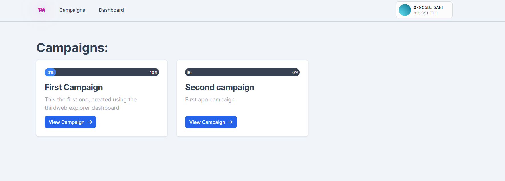

# Crowdfunding DApp

A DAap where users can create and fund their favourite campaigns.

## Table of Contents

1. [Features](#features)
2. [Demo](#demo)
3. [Technologies Used](#technologies-used)
4. [Installation and Setup](#installation-and-setup)
5. [Environment Variables](#environment-variables)
6. [Usage](#usage)
7. [Future Enhancements](#future-enhancements)
8. [Contributing](#contributing)
9. [License](#license)
10. [Contact](#contact)

## Features

- View campaigns
- Create campaign
- Fund campaign
- Create funding tiers
- Edit campaign

## Demo



[Live version](https://github.com/)

[Smart Contract](https://github.com/Egnoel/Crowdfunding_smartContract)

## Technologies Used

- ThirdWeb
- Nextjs
- TailwindCSS

## Installation and Setup

### Prerequisites

- Nodejs
- Yarn

### Steps to Install

1. Clone the repository:

   ```bash
   git clone https://github.com/Egnoel/Crowdfunding_DApp
   ```

2. Navigate to the project directory:

   ```bash
   cd Crowdfunding_DApp
   ```

3. Install dependencies:

   ```bash
   yarn install
   ```

4. Set up environment variables:

   Create a `.env` file and configure the necessary variables (explained below).

5. Run the development server:

   ```bash
   yarn dev
   ```

6. Open the app in your browser:

   ```bash
   http://localhost:3000
   ```

## Environment Variables

- NEXT_PUBLIC_TEMPLATE_CLIENT_ID: client id that you get when you create a project on the thirdweb application.

## Usage

- Login with your wallet using the sepolia testnet account

## Contributing

Instructions for contributing to the project.

1. Fork the repository.
2. Create a feature branch.
3. Commit your changes.
4. Push the branch and create a pull request.

## License

This project is licensed under the MIT License - see the [LICENSE](LICENSE) file for details.

## Contact

- **Email**: egnoel@hotmail.com
- **Twitter**: [@egnoelgenio](https://twitter.com/egnoelgenio)
